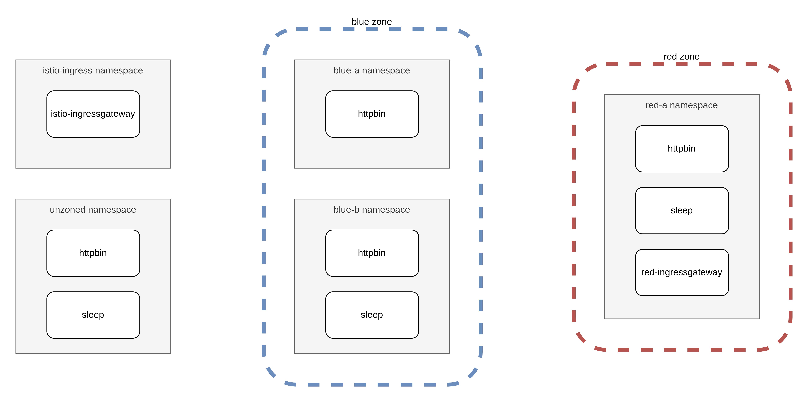
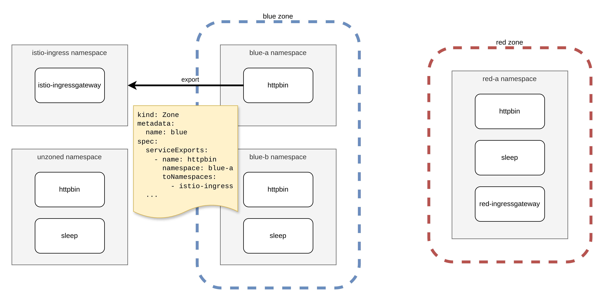
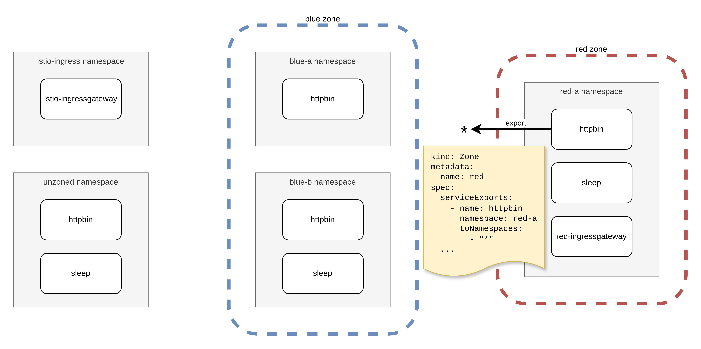
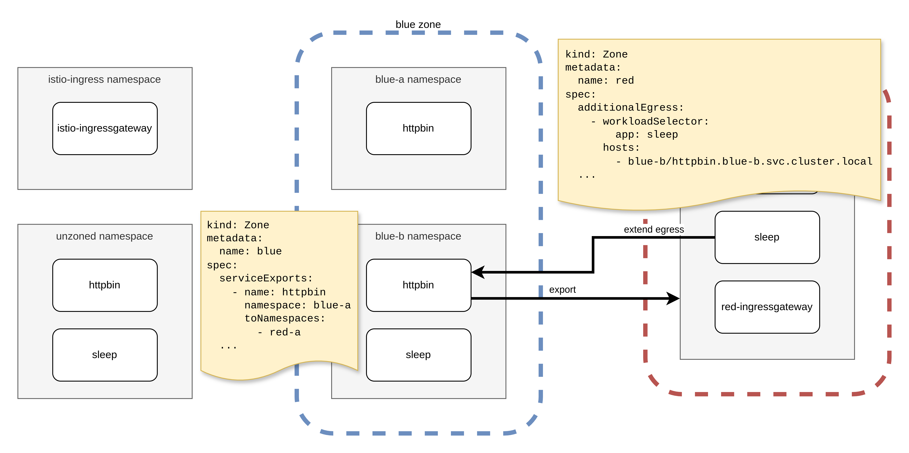
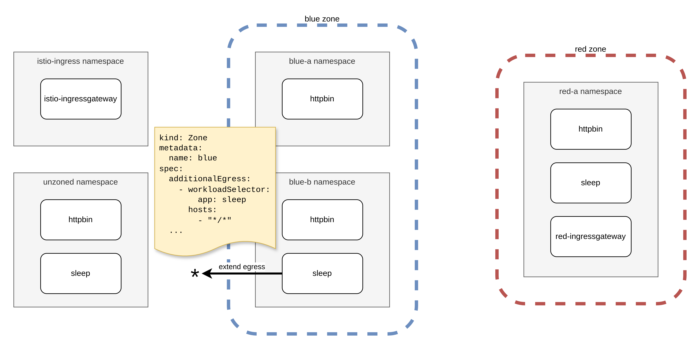

## Prerequisites

- helm CLI >= v3.6
- kubectl
- istioctl
- kind

## Setup

### Create cluster

```sh {"id":"01J4V7V6DMF11QY21PMT8KYEFH"}
kind create cluster --name zones
```

### Install Istio

```sh {"id":"01J4V7V6DMF11QY21PMVTYWA8E"}
helm install istio-base istio/base --version 1.22.3 -n istio-system --set defaultRevision=default --create-namespace
helm install istiod istio/istiod --version 1.22.3 -n istio-system --set meshConfig.accessLogFile=/dev/stdout --wait
```

### Install istio-multitenancy

```sh {"id":"01J4V7V6DMF11QY21PMYE7Z5RJ","interactive":"true"}
kubectl apply -k "https://github.com/eoinfennessy/istio-multitenancy//config/default/?version=v0.1.0"
```

### Create example Namespaces and Services

```sh {"id":"01J4V7V6DMF11QY21PN0TEV8RW","interactive":"true"}
sleep=https://raw.githubusercontent.com/istio/istio/1.22.3/samples/sleep/sleep.yaml
httpbin=https://raw.githubusercontent.com/istio/istio/1.22.3/samples/httpbin/httpbin.yaml

kubectl create namespace blue-a
kubectl label namespace blue-a istio.io/rev=default
kubectl apply -f $httpbin -n blue-a

kubectl create namespace blue-b
kubectl label namespace blue-b istio.io/rev=default
kubectl apply -f $sleep -n blue-b
kubectl apply -f $httpbin -n blue-b

kubectl create namespace red-a
kubectl label namespace red-a istio.io/rev=default
kubectl apply -f $sleep -n red-a
kubectl apply -f $httpbin -n red-a
helm install red-ingressgateway istio/gateway --version 1.22.3 -n red-a

kubectl create namespace istio-ingress
helm install istio-ingressgateway istio/gateway --version 1.22.3 -n istio-ingress

kubectl create namespace unzoned
kubectl label namespace unzoned istio.io/rev=default
kubectl apply -f $sleep -n unzoned
kubectl apply -f $httpbin -n unzoned

kubectl wait deployments --all --for condition=Available --all-namespaces
```

### Export pod name variables

```sh {"id":"01J4V7V6DMF11QY21PN4DHCFRJ","interactive":"false"}
export SLEEP_BLUE_B=$(kubectl get pod -l app=sleep -n blue-b -o jsonpath='{.items[].metadata.name}')
export SLEEP_RED_A=$(kubectl get pod -l app=sleep -n red-a -o jsonpath='{.items[].metadata.name}')
export SLEEP_UNZONED=$(kubectl get pod -l app=sleep -n unzoned -o jsonpath='{.items[].metadata.name}')
export ISTIO_INGRESSGATEWAY=$(kubectl get pod -l istio=ingressgateway -n istio-ingress -o jsonpath='{.items[].metadata.name}')
```

## Creating Zones



Below, we create two Zones, `blue` and `red`, specifying the namespaces to be included in each.

```sh {"id":"01J4V7V6DMF11QY21PN6MXRARB","interactive":"false"}
kubectl apply -f - <<EOF
apiVersion: multitenancy.istio.eoinfennessy.com/v1alpha1
kind: Zone
metadata:
  name: blue
spec:
  namespaces:
    - blue-a
    - blue-b
EOF
```

```sh {"id":"01J4V7V6DMF11QY21PNAKHXAQE","interactive":"false","terminalRows":""}
kubectl apply -f - <<EOF
apiVersion: multitenancy.istio.eoinfennessy.com/v1alpha1
kind: Zone
metadata:
  name: red
spec:
  namespaces:
    - red-a
EOF
```

When a Zone is created, a number of other resources are created or updated:

- Each Service in a Zone namespace is given an `exportTo` annotation to limit its visibility to only the Zone's namespaces.
- A Sidecar resource is created in each Zone namespace limiting the egress scope of sidecar proxies to namespaces included in the Zone.
- An AuthorizationPolicy is created in each Zone namespace to `ALLOW` requests from all Zone namespaces.
- Each of these resources is also given a label specifying the Zone the resource is currently part of. This label is used to clean up resources that should no longer belong to a Zone (after updating or deleting a Zone), and to ensure a resource is only part of one Zone.

After creating the Zones, the sidecar proxies in each Zone contain no config for services outside the Zone:

```sh {"id":"01J4VCDFDA7ES6SQ3187VQF7SN","interactive":"false","terminalRows":""}
istioctl proxy-config all $SLEEP_BLUE_B -n blue-b | grep red-a | wc -l
```

```sh {"id":"01J4V7V6DMF11QY21PNBX2C9K3","interactive":"false"}
istioctl proxy-config all $SLEEP_BLUE_B -n blue-b | grep unzoned | wc -l
```

Proxies in namespaces that have not been added to either Zone contain no config for services in Zone namespaces:

```sh {"id":"01J4VCMGGB6P2PSTFTEG6PERCF","interactive":"false"}
istioctl proxy-config all $SLEEP_UNZONED -n unzoned | grep blue-a | wc -l
```

```sh {"id":"01J4V7V6DMF11QY21PNDEX6SHQ","interactive":"false"}
istioctl proxy-config all $ISTIO_INGRESSGATEWAY -n istio-ingress | grep blue-a | wc -l
```

Workloads in a Zone namespace are not authorized access services in a different Zone:

```sh {"id":"01J4V7V6DMF11QY21PNDXDMSYN","interactive":"false"}
kubectl exec $SLEEP_BLUE_B -n blue-b -c sleep -- curl httpbin.red-a:8000/headers
```

Workloads in unzoned namespaces cannot access services in a Zone:

```sh {"id":"01J4V7V6DMF11QY21PNG7EZ369","interactive":"false"}
kubectl exec $SLEEP_UNZONED -n unzoned -c sleep -- curl httpbin.red-a:8000/headers
```

## Exporting services from a Zone to namespaces outside the Zone

Services in a Zone can be exported to namespaces outside the Zone by adding items to the Zone's `spec.ServiceExports`.

Below, we add an item in `spec.serviceExports` to export httpbin in the blue-a namespace to the istio-ingress namespace:



```sh {"id":"01J4V7V6DMF11QY21PNJ1B60BH","interactive":"false"}
kubectl apply -f - <<EOF
apiVersion: multitenancy.istio.eoinfennessy.com/v1alpha1
kind: Zone
metadata:
  name: blue
spec:
  namespaces:
    - blue-a
    - blue-b
  serviceExports:
    - name: httpbin
      namespace: blue-a
      toNamespaces:
        - istio-ingress
EOF
```

After applying this, the httpbin service in the blue-a namespace will be visible to proxies in the istio-ingress namespace:

```sh {"id":"01J4V7V6DN4GRGZSVYSNB7EENA","interactive":"true","terminalRows":"4"}
istioctl proxy-config all $ISTIO_INGRESSGATEWAY -n istio-ingress | grep blue-a
```

...and an AuthorizationPolicy has been created to allow traffic from istio-ingress to httpbin workloads:

```sh {"id":"01J4V7V6DN4GRGZSVYSNFT2Q79","interactive":"false","mimeType":"text/x-yaml"}
kubectl get authorizationpolicy zone-export-httpbin -n blue-a -o yaml
```

By specifying a wildcard, we can also export Services in Zone namespaces to the entire mesh (if the egress scope of the proxy is not limited to exclude the exported service):



```sh {"id":"01J4V7V6DN4GRGZSVYSSEPDB1G","interactive":"false"}
kubectl apply -f - <<EOF
apiVersion: multitenancy.istio.eoinfennessy.com/v1alpha1
kind: Zone
metadata:
  name: red
spec:
  namespaces:
    - red-a
  serviceExports:
    - name: httpbin
      namespace: red-a
      toNamespaces:
        - "*"
EOF
```

The httpbin service in the red-a namespace has now been exported to the entire mesh:

```sh {"id":"01J4V7V6DN4GRGZSVYSVZECM3V","interactive":"false"}
kubectl annotate service httpbin -n red-a --list
```

...and an AuthorizationPolicy allowing access to the service workloads has been created:

```sh {"id":"01J4V7V6DN4GRGZSVYSXQ8HA9Q","interactive":"false","mimeType":"text/x-yaml"}
kubectl get authorizationpolicy zone-export-httpbin -n red-a -o yaml
```

We can also export a service from one Zone to another Zone, but this requires that an `additionalEgress` entry is created in the Zone the service is being exported to (see next section):

```sh {"id":"01J4V7V6DN4GRGZSVYSYWYV5VW","interactive":"false"}
kubectl apply -f - <<EOF
apiVersion: multitenancy.istio.eoinfennessy.com/v1alpha1
kind: Zone
metadata:
  name: blue
spec:
  namespaces:
    - blue-a
    - blue-b
  serviceExports:
    - name: httpbin
      namespace: blue-a
      toNamespaces:
        - istio-ingress
    - name: httpbin
      namespace: blue-b
      toNamespaces:
        - red-a
EOF
```

Here, an additional `serviceExports` item has been added to export httpbin in the blue-b namespace to the red-a namespace. However, this will not yet be visible to proxies in the red namespace, as their egress scope has not yet been extended:

```sh {"id":"01J4V7V6DN4GRGZSVYT00RYVVW","interactive":"false"}
istioctl proxy-config all $SLEEP_RED_A -n red-a | grep blue-b | wc -l
```

In the next section we will extend the egress scope of selected proxies in the red Zone to include this exported service.

## Extending the egress scope of selected Zone proxies

In the previous step, we exported httpbin in the blue-b namespace to the red-a namespace, and observed that the proxy config for red Zone pods did not contain any backend for the exported service. This is because the egress scope of the red Zone's proxies has been limited to namespaces in the red Zone.

We can extend the egress scope of selected workloads in a Zone by adding items to the Zone's `spec.additionalEgress`:



```sh {"id":"01J4V7V6DN4GRGZSVYT40CDG8D","interactive":"false"}
kubectl apply -f - <<EOF
apiVersion: multitenancy.istio.eoinfennessy.com/v1alpha1
kind: Zone
metadata:
  name: red
spec:
  namespaces:
    - red-a
  serviceExports:
    - name: httpbin
      namespace: red-a
      toNamespaces:
        - "*"
  additionalEgress:
    - workloadSelector:
        app: sleep
      hosts:
        - blue-b/httpbin.blue-b.svc.cluster.local
EOF
```

Here, an `additionalEgress` item has been added to extend the scope of workloads in the red Zone that are labeled `app: sleep`. The scope of these workloads will be extended to include the httpbin service in the blue-a namespace. Multiple workload selector labels can be specified, and a workload must match all of them to be targeted. Hosts are specified in the `<namespace>/<FQDN>` format, and wildcards can be used for both the namespace and/or (part of) the FQDN.

We now have two Sidecar resources in the red-a namespace: The `default` namespace-scoped Sidecar and one that was created to extend the egress scope of the sleep pod:

```sh {"id":"01J4VFPXC5R046FE3V1BDDBTGR","interactive":"false","mimeType":"text/x-yaml"}
kubectl get sidecars -n red-a -o yaml
```

The proxy for the sleep pod in the red-a namespace will now include config for the httpbin service that we previously exported from the blue Zone:

```sh {"id":"01J4VDPZND65S24VY2YP1REEEY","terminalRows":"4"}
istioctl proxy-config all $SLEEP_RED_A -n red-a | grep blue-b
```

...and we can now successfully send requests from sleep in the red-a namespace to httpbin in the blue-b namespace:

```sh {"id":"01J4VE12VT4404TYFCRHQCFMP2","interactive":"true"}
kubectl exec $SLEEP_RED_A -n red-a -c sleep -- curl httpbin.blue-b:8000/headers
```

We can also add an `additionalEgress` item to extend the egress scope of a workload to include the entire mesh (excluding services that have not been exported from other Zones):



```sh {"id":"01J4VGCTNQGM2AFA5HFZRN2D6Z","interactive":"false"}
kubectl apply -f - <<EOF
apiVersion: multitenancy.istio.eoinfennessy.com/v1alpha1
kind: Zone
metadata:
  name: blue
spec:
  namespaces:
    - blue-a
    - blue-b
  serviceExports:
    - name: httpbin
      namespace: blue-a
      toNamespaces:
        - istio-ingress
    - name: httpbin
      namespace: blue-b
      toNamespaces:
        - red-a
  additionalEgress:
    - workloadSelector:
        app: sleep
      hosts:
        - "*/*"
EOF
```

Here, workloads in the blue Zone that match the label `app: sleep` will have their egress extended to include the entire mesh:

```sh {"id":"01J4VGKPQ5XGB146T8AS1Q9F6H"}
istioctl proxy-config all $SLEEP_BLUE_B -n blue-b | grep unzoned
```

...but unexported services in other Zones are not included in the proxy config:

```sh {"id":"01J4VGRYR7YQX892T798Y4Y15D","interactive":"false"}
istioctl proxy-config all $SLEEP_BLUE_B -n blue-b | grep sleep.red-a | wc -l
```

## Disabling AuthorizationPolicy management

AuthorizationPolicy management can be disabled by setting the Zone's `spec.manageAuthorizationPolicies` to `false`:

```sh {"id":"01J4VMNC9P3WT7W5NT3Q0D5BBJ","interactive":"false"}
kubectl apply -f - <<EOF
apiVersion: multitenancy.istio.eoinfennessy.com/v1alpha1
kind: Zone
metadata:
  name: blue
spec:
  namespaces:
    - blue-a
    - blue-b
  serviceExports:
    - name: httpbin
      namespace: blue-a
      toNamespaces:
        - istio-ingress
    - name: httpbin
      namespace: blue-b
      toNamespaces:
        - red-a
  additionalEgress:
    - workloadSelector:
        app: sleep
      hosts:
        - "*/*"
  manageAuthorizationPolicies: false
EOF
```

This causes the deletion of both the default/namespace-scoped AuthorizationPolicies and any additional workload-scoped policies created for `serviceExports`:

```sh {"id":"01J4VMSVRAJ750ZC6MM6BXCF8D","interactive":"true","terminalRows":"2"}
kubectl get authorizationpolicies -n blue-a
```

Workload proxies outside the blue Zone continue to contain no config for Zone services...

```sh {"id":"01J4VN5ZMFE51N2NDVN17PZQPV","interactive":"false"}
istioctl proxy-config all $SLEEP_UNZONED -n unzoned | grep blue-a | wc -l
```

...but traffic originating from outside the Zone is now authorized to access services within the Zone:

```sh {"id":"01J4VNEK30QT0MV5ESMS37EYWF","interactive":"false"}
kubectl exec $SLEEP_UNZONED -n unzoned -c sleep -- curl httpbin.blue-a:8000/headers
```

The above request is sent from the sleep pod as passthrough traffic--effectively treating httpbin as an external service. The next section details how passthrough behaviour can be used as an effective way of securing Zones in meshes that have strict mTLS enabled.

## Meshes with strict mTLS

Enable strict mTLS for the entire mesh:

```sh {"id":"01J4VPHZ3J1NK25SY36ZKBNWWV","interactive":"false"}
kubectl apply -n istio-system -f - <<EOF
apiVersion: security.istio.io/v1beta1
kind: PeerAuthentication
metadata:
  name: default
spec:
  mtls:
    mode: STRICT
EOF
```

In the previous step, after disabling AuthorizationPolicy management for the blue Zone, passthrough requests from outside the Zone were allowed. After setting the mTLS mode for the mesh to strict, these requests are now rejected:

```sh {"id":"01J4VPXGFJZ3ZR29TJZ1ESNFRG","interactive":"true"}
kubectl exec $SLEEP_UNZONED -n unzoned -c sleep -- curl httpbin.blue-a.svc.cluster.local:8000/headers
```

This happens because the passthrough request is sent as plaintext, but the service expects an mTLS connection.

TODO: Can a successful connection be made to httpbin.blue-a by adding a DestinationRule for sleep.unzoned? I tried the below DR and got this on the client:

`"GET /headers HTTP/1.1" 503 UC upstream_reset_before_response_started{connection_termination} - "-" 0 95 0 - "-" "curl/8.9.1" "ea468ad4-f648-44a9-98db-abd4ffe14980" "httpbin.blue-a.svc.cluster.local:8000" "10.96.93.212:8000" PassthroughCluster 10.244.0.15:50042 10.96.93.212:8000 10.244.0.15:50038 - allow_any`

...and this on the server:

`"- - -" 0 NR filter_chain_not_found - "-" 0 0 0 - "-" "-" "-" "-" "-" - - 10.244.0.8:8080 10.244.0.17:58394 - -`

Could a DR with `MUTUAL` mode be used to force an mTLS connection?

```sh {"id":"01J4VR1ARVKBNE2THXKY8ZZYDY"}
kubectl apply -n unzoned -f - <<EOF
apiVersion: networking.istio.io/v1
kind: DestinationRule
metadata:
  name: httpbin-istio-mtls
spec:
  host: httpbin.blue-a.svc.cluster.local
  trafficPolicy:
    tls:
      mode: ISTIO_MUTUAL
EOF
```

## Exposing a Zone's ingress gateway

If a Zone contains an ingress gateway, this gateway must be configured to allow access to traffic from outside the Zone. This can be achieved in a number of ways:

- Explicitly create an AuthorizationPolicy allowing external traffic to the gateway.
- Export the gateway service using the Zone's `ServiceExports` with `toNamespaces: ["*"]`. This will export the service to all mesh workloads (that do not have their egress scope limited to exclude the gateway's namespace host) and create an AuthorizationPolicy allowing all traffic to the gateway.
- Disable AuthorizationPolicy management for the entire Zone.

Below, an AuthorizationPolicy is created allowing access to the red Zone's ingress gateway. This will allow the gateway to be exposed to the internet after, for example, changing its Service type to `LoadBalancer` or routing to the Service using an Ingress resource.

```sh {"id":"01J534C3AS2ZRANMW5GTZFES4D"}
kubectl apply -n red-a -f - <<EOF
apiVersion: security.istio.io/v1
kind: AuthorizationPolicy
metadata:
  name: red-ingressgateway-allow-all
spec:
  selector:
    matchLabels:
      app: red-ingressgateway
  rules:
    - {}
EOF
```

## Setting the outbound traffic policy mode to `REGISTRY_ONLY`

When combined with Zones, setting Istio's outbound traffic policy mode to `REGISTRY_ONLY` is another effective way of enforcing tenant boundaries in a mesh. In outbound traffic policy mode, all traffic bound for services a proxy is not aware of will be blocked and respond with a 502 status. This means that traffic sent from a Zone appliction to any other service in the mesh outside the Zone will fail because the egress scope has been limited, and any traffic sent from outside the Zone to a service in the Zone will fail because the Service has only been exported to Zone namespaces.

This mode can be configured [globally](https://istio.io/latest/docs/reference/config/istio.mesh.v1alpha1/#MeshConfig-OutboundTrafficPolicy-Mode), or [using Sidecar resources](https://istio.io/latest/docs/reference/config/networking/sidecar/#OutboundTrafficPolicy). In the future, the Zone API may be extended to make this configurble at the Zone level.